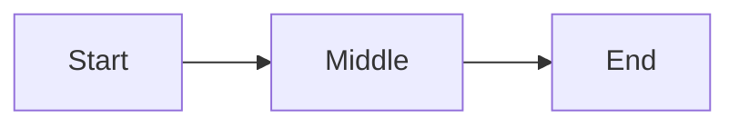

# themed_markdown — the authoring format

A document `body` IS themed-markdown — the format md-converter renders. Your
job is structure; styling is the renderer's. NEVER write visual instructions
(colors, fonts, sizes, themes) — apply the four semantic classes; the theme
picks colors. Use ONLY the constructs below; anything else drops silently or
breaks the render.

`req` = required · `opt` = optional · `≤N` = soft character cap (over-cap
wraps awkwardly / overflows a fixed UI slot).

## Frontmatter

```
---
title: Document Title
tags: [tag1, tag2]
date: YYYY-MM-DD
project: Project Name
purpose: Brief description
---
```

| Field | Status | Cap |
|---|---|---|
| `title` | req | ≤40 |
| `tags` | req (YAML list; `[]` ok) | — |
| `date` | opt | `YYYY-MM-DD` |
| `project` | opt | ≤40 |
| `purpose` | opt | ≤40 |

`date`/`project`/`purpose` -> footer meta cards. The render injects
`feature`, `roadmap_status`, `frozen`, `rendered_by`, `source` on top — NEVER
write those yourself. Tags = YAML list only; comma-separated (`tags: a, b`)
breaks.

## Structure

| Syntax | Role | Cap |
|---|---|---|
| `# Title` | doc title (opt; falls back to `frontmatter.title`) | — |
| `## Section` | sidebar tab | ≤28 |
| `### Heading` | subsection -> `<h3>` | ≤80 |

H4–H6 ⛔.

**Tab rule:** every H2 = one tab; content between two H2s belongs to the
first. Content between H1 and the first H2 is silently dropped — put intro
under an H2 (e.g. "Overview"). Single-section docs may omit H2s (whole doc =
one tab).

**Doc scale:** ≤25 sections + ≤15 Mermaid diagrams (every section renders
up-front; every Mermaid re-renders per tab switch) — split larger material.

## Inline · lists · tables · images · code

- Inline: `**bold**` · `*italic*` · `~~strike~~` · `` `code` `` · `[text](url)`
- Lists: `-` unordered · `1.` ordered · `- [ ]` / `- [x]` tasks
- Tables: standard GFM pipe tables
- Images: `` — absolute URLs only, descriptive alt
- Video: a bare video URL alone on its own line renders as a player — a
  `github.com/user-attachments/assets/<id>` URL (paste a video into a GitHub
  issue/PR to mint one) or any absolute URL ending `.mp4`/`.webm`/`.mov`/`.ogg`.
  NEVER wrap it in `` / `[]()` — bare triggers the player.
- Code: fenced with a language hint (```` ```python ````)

## Color classes

`class1`–`class4` — on callouts, stat cards, mermaid nodes, linear steps.
Choose the class by meaning; the theme decides the color. Keep one class per
semantic role across the doc (e.g. `class1` = primary, `class2` = supporting,
`class3` = positive/done, `class4` = caution/warning). Consistency >
specific choice.

## Callouts

```
> [!class1]
> Callout content.
```
Cap ≤280 (one short paragraph). class1–class4.

## Stat cards

````
```stats
:::class1
value: 87%
label: User satisfaction
description: Up 12% from last quarter
:::class2
value: 1.2M
label: Active users
```
````

| Field | Status | Cap | Notes |
|---|---|---|---|
| `value` | req | ≤12 | short token (`87%`, `1.2M`) — not sentences |
| `label` | req | ≤28 | one short noun phrase |
| `description` | opt | one short line | omit if no signal |

Layout: 2 per row; trailing odd card spans the row.

## Mermaid

````

````

Class via `:::classN` on nodes. The app injects `classDef` — NEVER write
`classDef`, `fill:`, or any style directive. Node label cap ≤24 (long labels
balloon auto-sized nodes).

**Quote labels with special characters** — unquoted node text is parsed as
Mermaid grammar. Any label containing `/`, `(`, `)`, `*`, `[`, `]`, `{`, `}`,
`<`, `>`, `#`, `:`, `;`, or a quote MUST be double-quoted inside the brackets
-> else *"Syntax error in text"* and nothing renders. Notably `A[/text/]` =
the parallelogram shape, so a literal path like `/lease/mail/*` breaks unless
quoted.

```
GOOD:  AD["/admin/user-credentials/"]:::class3
       N["count > 0"]:::class2
BAD:   AD[/admin/user-credentials/]      (parsed as a parallelogram shape → error)
       N[count > 0]                      (> is a grammar token → error)
```

Cylinder/stadium shapes are fine as-is — `DB[(secrets.db)]`, `X([ready])` —
quote only the inner text, not the shape brackets.

## Linear

````
```linear
Step 1 :::class1 -> Step 2 :::class2 -> Step 3 :::class3
```
````
Steps separated by `->`, optional `:::classN`. Renders vertically — one step
per row, top→bottom (never horizontal). Step text cap ≤48.

## Never

- H4–H6 · blockquotes (except callouts) · footnotes · raw HTML
- Color / font / size / theme / visual mentions (the theme owns styling)
- Content between H1 and the first H2 (silently dropped — use an H2)
- Comma-separated `tags` (must be a YAML list)
- `classDef` / `fill:` / style directives inside Mermaid
- Unquoted Mermaid labels containing special characters

## Open in md-converter

A doc whose `body` lives in the DB already opens in the app from the GUI
("open in md-converter ↗" on the Roadmap/Docs card) — author nothing there.

When committing a **standalone** themed-markdown file to the repo (a README,
or a rendered `docs_sc/` page meant to be read on GitHub), drop a one-click
badge in its preamble — between `# Title` and the first `##` (shows on
GitHub, dropped from the render by the preamble rule):

```markdown
[](https://md-converter.designs-os.com/?url=https://github.com/<owner>/<repo>/blob/<branch>/<path>)
```

Fill `<owner>/<repo>/<branch>/<path>` with the file's GitHub location (any
subdirectory depth). Public repos only — the badge fetches the raw file in
the reader's browser (no server/auth). Destination unknown -> keep the
placeholders and tell the user to fill them.
